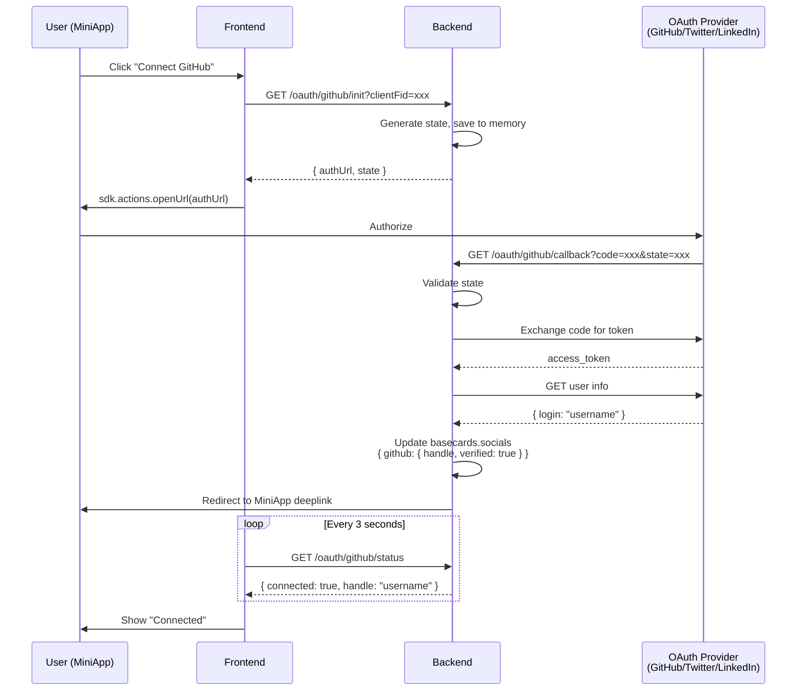

# OAuth Integration Documentation

## Overview

BaseCard uses OAuth 2.0 for social account verification (GitHub, Twitter/X, LinkedIn). The implementation follows a **server-side OAuth flow** with frontend polling to handle the MiniApp environment constraints.

## Architecture



## API Endpoints

### 1. Initialize OAuth Flow

```
GET /v1/oauth/:provider/init?clientFid=xxx&returnUrl=/edit-profile
Authorization: Bearer <JWT>
```

**Response:**

```json
{
  "success": true,
  "result": {
    "authUrl": "https://github.com/login/oauth/authorize?...",
    "state": "random-hex-string"
  }
}
```

### 2. OAuth Callback (called by provider)

```
GET /v1/oauth/:provider/callback?code=xxx&state=xxx
```

- Validates `state` against stored value
- Exchanges `code` for `access_token`
- Fetches user info from provider API
- Updates DB with `{ handle, verified: true }`
- Redirects to MiniApp deeplink

### 3. Check Connection Status (for polling)

```
GET /v1/oauth/:provider/status
Authorization: Bearer <JWT>
```

**Response:**

```json
{
  "success": true,
  "result": {
    "connected": true,
    "handle": "username",
    "verified": true
  }
}
```

### 4. Disconnect OAuth

```
DELETE /v1/oauth/:provider
Authorization: Bearer <JWT>
```

## Security Analysis

### ✅ Implemented Security Measures

| Security Measure               | Implementation                                 | Status |
| ------------------------------ | ---------------------------------------------- | ------ |
| **CSRF Protection**            | Random `state` parameter validated on callback | ✅     |
| **State Expiry**               | 5-minute TTL on state tokens                   | ✅     |
| **One-time State**             | State deleted after use                        | ✅     |
| **Server-side Token Exchange** | `client_secret` never exposed to frontend      | ✅     |
| **JWT Authentication**         | `/init` and `/status` require valid JWT        | ✅     |
| **PKCE (Twitter)**             | Code verifier/challenge for Twitter OAuth 2.0  | ✅     |

### ⚠️ Considerations

| Item              | Current State          | Recommendation                                      |
| ----------------- | ---------------------- | --------------------------------------------------- |
| **State Storage** | In-memory Map          | Redis for multi-instance deployment                 |
| **Rate Limiting** | Not implemented        | Add rate limits to prevent abuse                    |
| **Token Storage** | Not stored (stateless) | Consider storing refresh tokens for future features |

### Why No Separate Auth in OAuth Module?

The OAuth module **does not need its own auth logic** because:

1. **Initialization (`/init`) is protected by `JwtAuthGuard`**
   - Only authenticated users can start OAuth flow
   - `userId` is extracted from JWT, not from user input

2. **Callback (`/callback`) is protected by `state` validation**
   - State is tied to a specific `userId` at init time
   - Callback cannot be forged without knowing the state

3. **Status/Disconnect are protected by `JwtAuthGuard`**
   - Only the authenticated user can check/modify their own connections

## Environment Variables

```env
# OAuth Deeplink Configurations
FARCASTER_MINIAPP_DEEPLINK="https://farcaster.xyz/miniapps/xxx/basecard"
BASEAPP_MINIAPP_DEEPLINK="cbwallet://miniapp?url=https://miniapp.basecard.org"
MINIAPP_URL=https://miniapp.basecardteam.org

# Provider Credentials
GITHUB_CLIENT_ID=xxx
GITHUB_CLIENT_SECRET=xxx
X_CLIENT_ID=xxx
X_CLIENT_SECRET=xxx
LINKEDIN_CLIENT_ID=xxx
LINKEDIN_CLIENT_SECRET=xxx
```

## Client FID Configuration

Deeplinks are routed based on `clientFid` using the `CLIENT_FIDS` constant:

```typescript
// backend/src/app/constants.ts
export const CLIENT_FIDS = {
  METAMASK: 0,
  FARCASTER: 9152, // → FARCASTER_MINIAPP_DEEPLINK
  BASEAPP: 309857, // → BASEAPP_MINIAPP_DEEPLINK
} as const;
```

| Client FID | Client Type | Deeplink Format                                                  |
| ---------- | ----------- | ---------------------------------------------------------------- |
| 9152       | `farcaster` | `farcaster.xyz/miniapps/xxx/basecard/path?params`                |
| 309857     | `baseapp`   | `cbwallet://miniapp?url=encoded(https://miniapp.../path?params)` |
| Other      | `warpcast`  | `https://miniapp.../path?params` (direct URL)                    |

## Data Model

### Socials in `basecards` table

```typescript
// Old format (manual input, unverified)
socials: {
  github: "username",
  linkedin: "https://linkedin.com/in/username"
}

// New format (OAuth verified)
socials: {
  github: { handle: "username", verified: true },
  x: { handle: "username", verified: true },
  linkedin: { handle: "Full Name", verified: true }
}
```

### Merge Logic in `processUpdate`

When editing a basecard:

1. Frontend sends socials (may include manual values)
2. Backend merges with DB verified socials
3. **Verified socials override frontend values**
4. Final payload is sent to smart contract

## Frontend Integration

See: `miniapp/hooks/useGitHubAuth.ts`, `useTwitterAuth.ts`, `useLinkedInAuth.ts`

```typescript
const { status, username, connect, disconnect } = useGitHubAuth({
  initialUsername: card?.socials?.github?.handle,
  initialVerified: card?.socials?.github?.verified,
  onUsernameChange: (handle) => {
    /* update form */
  },
});
```
